# 搭建SLAM环境

[TOC]


## 1 ubuntu系统的安装

​	网上教程一大堆，随便找

​	注意：
​			查看系统BISO的类型

​			系统分区的挂载

### 1.1 AMD安装出来的一大堆毛病（没wifi、亮度无法调节等）

**主要是更新内核**

查看Ubuntu内核版本

```
uname -a
```

https://blog.csdn.net/weixin_40647655/article/details/109228578

内核官网【https://kernel.ubuntu.com/~kernel-ppa/mainline/】

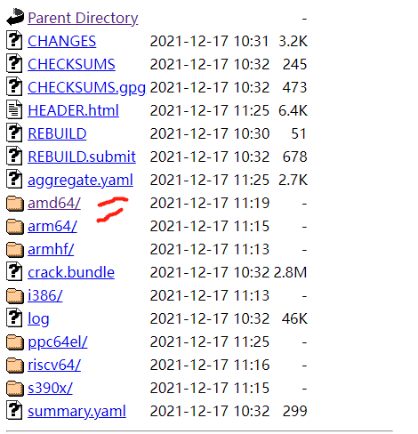

三个generic 一个all.deb

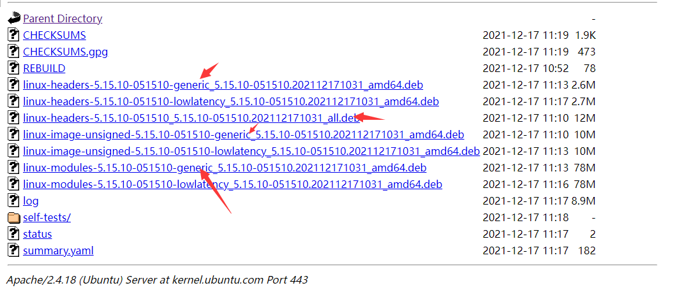

```
sudo dpkg -i *.deb
```

更新firmware【https://mirrors.tuna.tsinghua.edu.cn/kernel/firmware/】
采用有线连接网络, install the `cmake` firstly

```
sudo apt-get update  (更新源) 
sudo apt-get upgrade  (更新已安装的包)
sudo apt-get install cmake
```


```
mkdir build && cd build
cmake ..
make
sudo make install
```

## Ubuntu20.04的安装

### 1. 分配磁盘空间

右键“计算机”，点击“属性”，进入到磁盘管理

​                 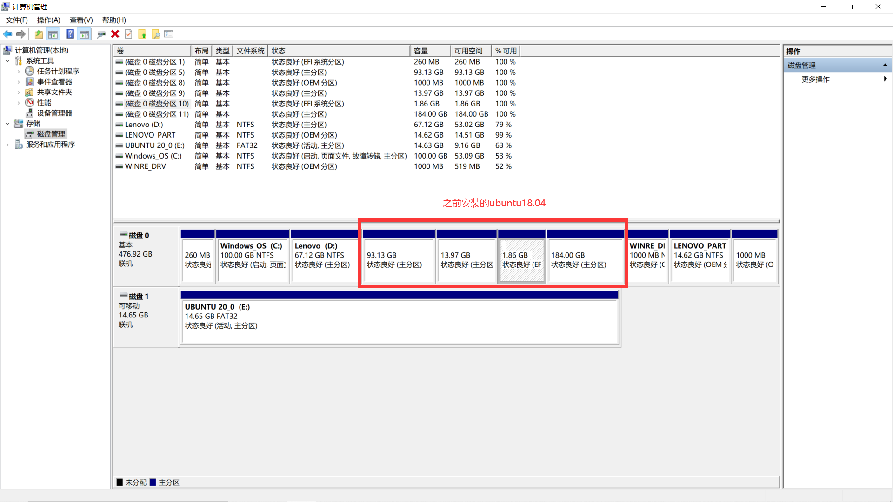        

中间是之前装ubuntu18.04所用的空间，其实可以不用在这里“删除卷”，可以统一到安装ubuntu的时候在**磁盘分区**中进行删除

​                 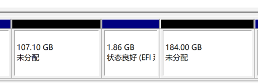                


### 2. 进入系统BIOS，设置启动引导（fn+f2）

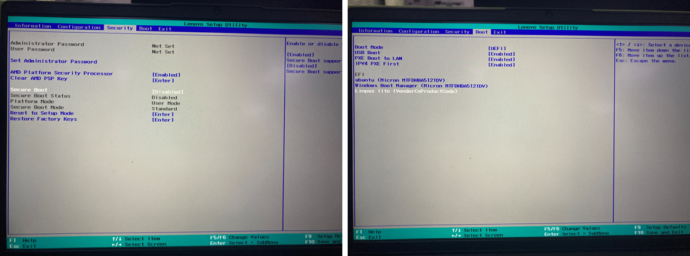


### 3. 开始安装


**此处注意选择最后一个，不然会删除win系统资料**


**分配空间**，根目录“/”，选择“主分区，起始地址”

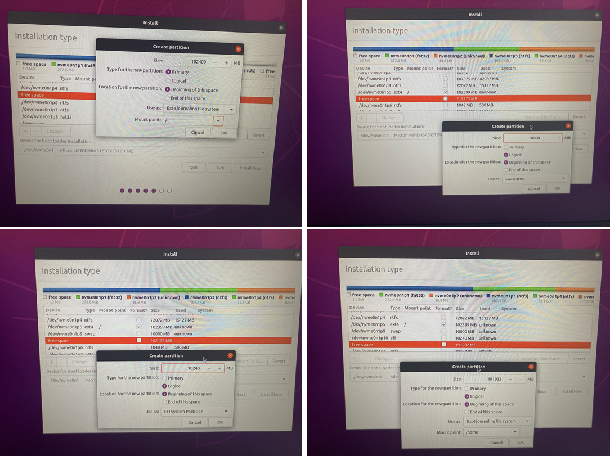

**挂载，系统所在的磁盘分区**

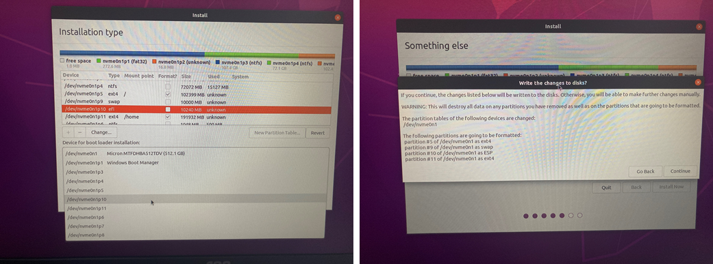


安装成功

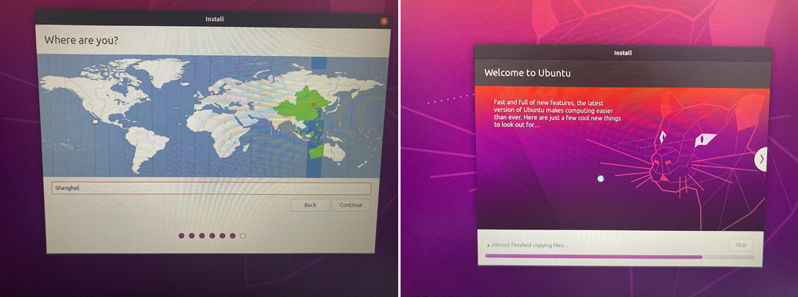


### 4 Ubuntu20.04配置SLAM十四讲的环境时存在的问题

#### 4.1 fmt报错

报错详情

```
/usr/bin/ld: CMakeFiles/pose_estimation_3d2d.dir/pose_estimation_3d2d.cpp.o: in function `void fmt::v8::print<Eigen::Transpose<Eigen::Matrix<double, 4, 1, 0, 4, 1> > >(fmt::v8::basic_format_string<char, fmt::v8::type_identity<Eigen::Transpose<Eigen::Matrix<double, 4, 1, 0, 4, 1> > >::type>, Eigen::Transpose<Eigen::Matrix<double, 4, 1, 0, 4, 1> >&&)':
/usr/local/include/fmt/core.h:3198: undefined reference to `fmt::v8::vprint(fmt::v8::basic_string_view<char>, fmt::v8::basic_format_args<fmt::v8::basic_format_context<fmt::v8::appender, char> >)'
/usr/bin/ld: CMakeFiles/pose_estimation_3d2d.dir/pose_estimation_3d2d.cpp.o: in function `void fmt::v8::print<>(fmt::v8::basic_format_string<char>)':
/usr/local/include/fmt/core.h:3198: undefined reference to `fmt::v8::vprint(fmt::v8::basic_string_view<char>, fmt::v8::basic_format_args<fmt::v8::basic_format_context<fmt::v8::appender, char> >)'
```

解决方案

```
修改CMakeLists
include_directories("usr/local/include/fmt" )
然后在target_link_libararies添加fmt
target_link_libraries(pose_estimation_3d2d
        g2o_core g2o_stuff
        ${OpenCV_LIBS}
        fmt)
```

【参考】https://blog.csdn.net/Evanzxh/article/details/119757742


#### 4.2  ch8讲，C++编译标准的问题

需要修改c++编译标准

```
set(CMAKE_CXX_FLAGS "-std=c++14 -O2 ${SSE_FLAGS} -msse4")
```

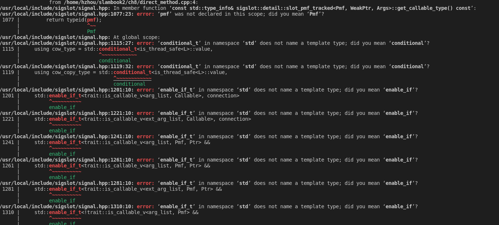


#### 4.3 ch13讲，运行slam系统报错

要采用C++11的标准

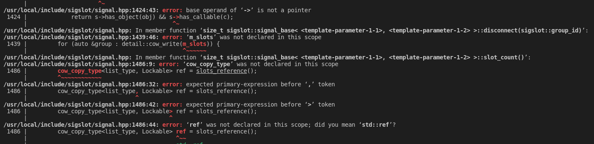


找不到这个链接库

先看有没有，有的话建立软链接

```
首先定位libglut.so*
locate libglut.so*

若没有相应的库，则安装
sudo apt-get install libglut-dev

若有建立软连接
cd /usr/lib/x86_64-linux-gnu/
sudo ln -s libglut.so.3 libglut.so
```

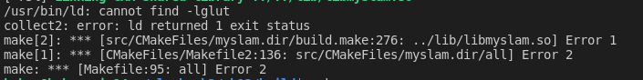

参考【https://www.jianshu.com/p/0695757d8111】


**然后**fmt又报错，

```
先把原来的卸载掉
xargs rm < install_manifest.txt
进入安装源文件 fmt/build中,找到CMakeCache.txt
改为CMAKE_CXX_FLAGS:STRING=-fPIC

再重新安装
make
sudo make install
```

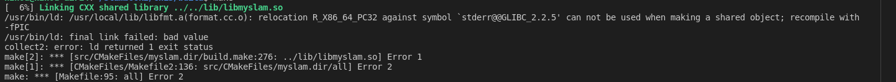


### 5 ubuntu20.04编译ORB SLAM存在的问题

#### ５.１　C++编译标准的问题

和前面ch8讲报错一样，可能是不支持C++11的编译，还是不兼容？

我直接修改CMakeLists中编译要求修改为

C++14的标准，并把前面判断编译标准的代码注释掉了

```
   set(CMAKE_CXX_FLAGS "${CMAKE_CXX_FLAGS} -std=c++11")
   add_definitions(-DCOMPILEDWITHC11)
   message(STATUS "Using flag -std=c++11.")
```

#### 5.2 不知道的错误

```
:KeyFrame*, g2o::Sim3> > >’:
/home/hzhou/Documents/ORB_SLAM2-master/src/LoopClosing.cc:439:21:   required from here
/usr/include/c++/9/bits/stl_map.h:122:71: error: static assertion failed: std::map must have the same value_type as its allocator
  122 |       static_assert(is_same<typename _Alloc::value_type, value_type>::value,
```

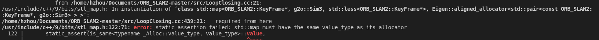

打开LoopClosing.h，将

```
typedef map<KeyFrame*,g2o::Sim3,std::less<KeyFrame*>,
        Eigen::aligned_allocator<std::pair<const KeyFrame*, g2o::Sim3> > > KeyFrameAndPose;
```

改为

```
typedef map<KeyFrame*,g2o::Sim3,std::less<KeyFrame*>,
        Eigen::aligned_allocator<std::pair<KeyFrame *const, g2o::Sim3> > > KeyFrameAndPose;
```

参考【https://blog.csdn.net/lixujie666/article/details/90023059】

这个错误貌似也是因为C++编译器版本的问题

把gcc和g++的版本降低到7以后就没有这个问题了

[Ubuntu20.04终端安装、切换低版本gcc/g++](https://blog.csdn.net/EternallyAccompany/article/details/108865331?spm=1001.2101.3001.6650.1&utm_medium=distribute.pc_relevant.none-task-blog-2%7Edefault%7ECTRLIST%7Edefault-1.highlightwordscore&depth_1-utm_source=distribute.pc_relevant.none-task-blog-2%7Edefault%7ECTRLIST%7Edefault-1.highlightwordscore)

#### 5.3 chrono时间报错

报错

```
error: ‘std::chrono::monotonic_clock’ has not been declared
```

网上说可能是因为不支持monotonic_clock，

解决方法，直接在EXample里面的几个.cc文件中，定义

```
#define COMPILEDWITHC11
这样就默认采用的是std::chrono::steady_clock
```

【参考】https://blog.csdn.net/weixin_45983731/article/details/117969879?utm_medium=distribute.pc_relevant.none-task-blog-2~default~BlogCommendFromBaidu~default-5.no_search_link&depth_1-utm_source=distribute.pc_relevant.none-task-blog-2~default~BlogCommendFromBaidu~default-5.no_search_link


## 2 安装VScode编辑器

直接在软件中下载

安装插件

```
C/C++ 
Cmake
Cmkae Tools
Code Runner  在Setting 中设置RUN IN TERMINAL
Chinese
better comments  自定义颜色在window好设置，在Ubuntu中还没有设置好？
```

终端输出的字体太乱

setting -> font ->终端 _>Font Family 改为  'monospace'

同步设置：https://www.php.cn/tool/vscode/489147.html

## 3 SLAM十四讲环境配置

### 3.1.1 ch3，eigen安装

不要使用该命令安装，会默认安装3.2版本的eigen

```
sudo apt-get install libeigen3-dev   //安装到/usr/include/eigen3
```

在vscode 编辑配置中添加  "/usr/include/**"

**先删除**

```
先找到安装的位置
sudo updatedb  
locate eigen3 

直接删掉这些文件或文件夹
 
sudo rm -rf /usr/include/eigen3 /usr/lib/cmake/eigen3 /usr/share/doc/libeigen3-dev /usr/share/pkgconfig/eigen3.pc /var/lib/dpkg/info/libeigen3-dev.list /var/lib/dpkg/info/libeigen3-dev.md5sums
```

在官网下载eigen3.3.7的版本，[eigen官网](https://gitlab.com/libeigen/eigen/-/releases)，解压后

```
mkdir build
cd build
cmake ..
sudo make install  
**I change it** sudo  make install DESTDIR=/usr/slam_packages/eigen3.3.7


#安装后头文件安装在/usr/local/include/eigen3/
#移动头文件
sudo cp -r /usr/local/include/eigen3/Eigen /usr/local/include
【备注】:在很多程序中 include 时经常使用 #include <Eigen/Dense> 而不是使用 #include
<eigen3/Eigen/Dense> 所以要做下处理

sudo ln -s /usr/slam_packages/eigen3.3.7/usr/local/include/eigen3 /usr/local/include/eigen3

rm -rf /usr/local/include/eigen3
后面不能加/
```


https://blog.csdn.net/weixin_44684139/article/details/104803225

### 3.1.2 ch3，Pangolin

按照这个装

首先安装Pangolin所需依赖

```
sudo apt install libgl1-mesa-dev
sudo apt install libglew-dev
sudo apt install cmake
sudo apt install libpython2.7-dev
sudo apt install python-pip
sudo python[2or3] -m pip install numpy pyopengl Pillow pybind11
sudo apt install pkg-config
sudo apt install libegl1-mesa-dev libwayland-dev libxkbcommon-dev wayland-protocols
sudo apt install ffmpeg libavcodec-dev libavutil-dev libavformat-dev libswscale-dev libavdevice-dev
sudo apt install libdc1394-22-dev libraw1394-dev
sudo apt install libjpeg-dev libpng-dev libtiff5-dev libopenexr-dev
```

解压pangolin的压缩包

```
cd Pangolin
mkdir build
cd build
cmake ..
cmake --build .
如果遇到 ：error: ISO C++1z does not allow dynamic exception specifications 类似报错
使用：cmake -DBUILD_PANGOLIN_LIBOPENEXR=OFF .. #目的是禁用OpenEXR
sudo make install
```

测试

```
    cd ~/Pangolin/build/examples/HelloPangolin
    ./HelloPangolin
```

https://blog.csdn.net/qq_43647590/article/details/120226747


【测试ch3的代码】

报错：找不到pangolin.h


```
把头文件链接过去
sudo ln -s /usr/slam_packages/pangolin/usr/local/include/NaturalSort/ /usr/local/include/
sudo ln -s /usr/slam_packages/pangolin/usr/local/include/sigslot/ /usr/local/include/
sudo ln -s /usr/slam_packages/pangolin/usr/local/include/tinyobj/ /usr/local/include/
sudo ln -s /usr/slam_packages/pangolin/usr/local/include/dynalo/ /usr/local/include/
```

更新库链接

sudo ldconfig


【2021/12/17】安装pangolin0.5的版本无法使用C++11的编译器


### 3.2 ch4，Sophus安装

编译useSophus.cpp 报错

```
/usr/local/include/sophus/rotation_matrix.hpp:4:10: fatal error: Eigen/Dense: 没有那个文件或目录
 #include <Eigen/Dense>
```

这是因为 eigen 库安装在了 /usr/include/eigen3/Eigen 路径下或者/usr/local/eigen3/Eigen，需使用下面命令映射到 /usr/include 路径下

```
    sudo ln -s /usr/include/eigen3/Eigen /usr/include/Eigen
    //或者 sudo ln -s /usr/local/include/eigen3/Eigen /usr/include/Eigen
```

按照这个博客装

https://blog.csdn.net/scut_xz/article/details/117326970


【测试ch4代码】

### 3.3 ch5，opencv安装

#### 3.3.1 安装ROS

ros里面就包括了opencv了

```
用这个方法
rosdep init 和 rosdep update可以直接用下载好的文件rosdep
1.sudo sh -c 'echo "deb http://packages.ros.org/ros/ubuntu $(lsb_release -sc) main" > /etc/apt/sources.list.d/ros-latest.list'
2.sudo apt-key adv --keyserver 'hkp://keyserver.ubuntu.com:80' --recv-key C1CF6E31E6BADE8868B172B4F42ED6FBAB17C654
3.sudo apt update
4.sudo apt install ros-melodic-desktop-full


5.把文件rosdep拷贝到/etc/ros下	在rosdep文件目录下输入 sudo cp -r rosdep /etc/ros

用户环境设置
echo "source /opt/ros/melodic/setup.bash" >> ~/.bashrc 
source ~/.bashrc 

 安装包编译依赖
sudo apt install python-rosinstall python-rosinstall-generator python-wstool build-essential
6.开一个终端运行roscore(若提示无法找到命令则重新运行sudo apt install ros-melodic-desktop-full)
7.开一个终端运行rosrun turtlesim turtlesim_node 会出现小乌龟
8.开一个终端运行rosrun turtlesim turtle_teleop_key，可以在该终端下通过键盘操控乌龟行走
```

【用**ch5测试**opencv】

#### 3.3.2 安装opencv3以上的版本

由于ch8中的直接光流法会需要，opencv3

这里安装的是opencv4.1.0

```
安装依赖
sudo apt-get install build-essential libgtk2.0-dev libgtk-3-dev libavcodec-dev libavformat-dev libjpeg-dev libswscale-dev libtiff5-dev
sudo apt install python3-dev python3-numpy
sudo apt install libgstreamer-plugins-base1.0-dev libgstreamer1.0-dev
sudo apt install libpng-dev libopenexr-dev libtiff-dev libwebp-dev

安装
mkdir build
cd build
cmake -D CMAKE_BUILD_TYPE=Release -D OPENCV_GENERATE_PKGCONFIG=ON -D CMAKE_INSTALL_PREFIX=/usr/local/opencv4 ..
make -j4
sudo make install
```

最后在CMakeLists中添加opencv4配置文件的路径

```
报错
error: ‘CV_GRAY2BGR’ was not declared in this scope     cv::cvtColor(img2, img2_show, CV_GRAY2BGR);

将则需要将CV_GRAY2BGR，更新为COLOR_GRAY2BGR
cv::cvtColor(img2, img2_show, COLOR_GRAY2BGR);
```

https://blog.csdn.net/weixin_44684139/article/details/105007316


**安装opencv4 冒得用**，直接法还是会报错，还是要opencv3

```
首先再安装一下依赖项
sudo apt-get install build-essential libgtk2.0-dev libvtk5-dev libjpeg-dev libtiff4-dev libjasper-dev libopenexr-dev libtbb-dev

解压opencv 3.4.1

安装opencv
mkdir build
cd build
cmake -D CMAKE_BUILD_TYPE=Release -D CMAKE_INSTALL_PREFIX=/usr/local/opencv3 ..
make -j4
sudo make install

在CMakeLists中添加
set(OpenCV_DIR "/usr/local/opencv3/share/OpenCV")
```

https://www.icode9.com/content-4-906639.html


ORB SLAM2 中安装opencv3.4.5

```
安装依赖
sudo apt-get install build-essential libgtk2.0-dev libavcodec-dev libavformat-dev libjpeg.dev
sudo apt-get install libtiff5.dev libswscale-dev libjasper-dev
sudo add-apt-repository "deb http://security.ubuntu.com/ubuntu xenial-security main"
sudo apt-get update

20.04的依赖
sudo apt-get install cmake git libgtk2.0-dev pkg-config libavcodec-dev libavformat-dev libswscale-dev
sudo apt-get install python-dev python-numpy libtbb2 libtbb-dev libjpeg-dev libpng-dev libtiff-dev libjasper-dev libdc1394-22-dev
上一句报错，则更新源后重新执行
sudo add-apt-repository "deb http://security.ubuntu.com/ubuntu xenial-security main"
sudo apt-get update

cd opencv-3.4.5
mkdir build
cd build
cmake ..
make
sudo make install

配置环境变量
sudo vim /etc/ld.so.conf.d/opencv.conf
在打开的空白文件中添加 /usr/local/lib

执行 sudo ldconfig ,使配置的环境变量生效

配置 .bashrc ,末尾添加下面两行
//打开.bashrc
sudo vim /etc/bash.bashrc
//添加以下两行内容到.bashrc
PKG_CONFIG_PATH=$PKG_CONFIG_PATH:/usr/local/lib/pkgconfig
export PKG_CONFIG_PATH

source 与 update
source /etc/bash.bashrc
sudo updatedb

测试是否正常安装 (成功会出现带 “hello opcv” 字样的窗口)
cd opencv-3.4.5/samples/cpp/example_cmake
cmake .
make
./opencv_example
```


### 3.4 ch6，优化库安装

#### 3.4.1 Ceres安装

- 安装依赖

  ```
  sudo apt-get install liblapack-dev libsuitesparse-dev libcxsparse3 libgflags-dev libgoogle-glog-dev libgtest-dev
  ```

  

- 下载包

- cmake工程编译

  ```
  mkdir build
  cd build
  cmake ..
  make
  ```

  

- 安装

  ```
  sudo make install
  ```

  https://blog.csdn.net/Coderii/article/details/87601836

#### 3.4.2  G20安装

按书上安装

```
sudo apt-get install qt5-qmake qt5-default libqglviewer-dev-qt5 libsuitesparse-dev libcxsparse3 libcholmod3
```

**装完后，在build文件夹目录环境下输入**：

```
sudo ldconfig
```

测试前把g2o里面代码修改一下

```
typedef g2o::BlockSolver< g2o::BlockSolverTraits<3,1> > Block;  // 每个误差项优化变量(eg. abc)度为D，误差值(eg. error)维度为d
Block::LinearSolverType* linearSolver = new g2o::LinearSolverDense<Block::PoseMatrixType>(); // 线性方程求解器
Block* solver_ptr = new Block( linearSolver );      // 矩阵块求解器

g2o::OptimizationAlgorithmLevenberg( solver_ptr );
g2o::OptimizationAlgorithmGaussNewton* solver = new g2o::OptimizationAlgorithmGaussNewton( solver_ptr );

g2o::SparseOptimizer optimizer;     // 图模型
optimizer.setAlgorithm( solver );   // 设置求解器
optimizer.setVerbose( true );       // 打开调试输出
```

**貌似我直接用3rdparty中的g2o就不用换这个**
**果然还是的用那个，不然ch10中的g2o_viewer缺失**

https://www.cnblogs.com/xueyuanaichiyu/p/7921382.html

【测试ch6代码】

### ch7 报fmt的错

报错详情

```
/usr/bin/ld: CMakeFiles/pose_estimation_3d2d.dir/pose_estimation_3d2d.cpp.o: in function `void fmt::v8::print<Eigen::Transpose<Eigen::Matrix<double, 4, 1, 0, 4, 1> > >(fmt::v8::basic_format_string<char, fmt::v8::type_identity<Eigen::Transpose<Eigen::Matrix<double, 4, 1, 0, 4, 1> > >::type>, Eigen::Transpose<Eigen::Matrix<double, 4, 1, 0, 4, 1> >&&)':
/usr/local/include/fmt/core.h:3198: undefined reference to `fmt::v8::vprint(fmt::v8::basic_string_view<char>, fmt::v8::basic_format_args<fmt::v8::basic_format_context<fmt::v8::appender, char> >)'
/usr/bin/ld: CMakeFiles/pose_estimation_3d2d.dir/pose_estimation_3d2d.cpp.o: in function `void fmt::v8::print<>(fmt::v8::basic_format_string<char>)':
/usr/local/include/fmt/core.h:3198: undefined reference to `fmt::v8::vprint(fmt::v8::basic_string_view<char>, fmt::v8::basic_format_args<fmt::v8::basic_format_context<fmt::v8::appender, char> >)'
```

解决方案

```
修改CMakeLists
include_directories("usr/local/include/fmt" )
然后在target_link_libararies添加fmt
target_link_libraries(pose_estimation_3d2d
        g2o_core g2o_stuff
        ${OpenCV_LIBS}
        fmt)
```

【参考】https://blog.csdn.net/Evanzxh/article/details/119757742


### ch8 报错

需要修改c++编译标准

```
set(CMAKE_CXX_FLAGS "-std=c++14 -O2 ${SSE_FLAGS} -msse4")
```


修改以后，又报错

添加fmt的头文件，可能是因为安装的sophus的库时候，是先依赖fmt

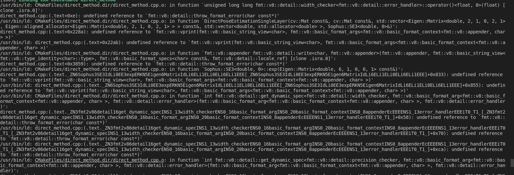

### 3.5 ch9 meshlab的安装

感觉是网络的问题，一直下载不了那个库

https://blog.csdn.net/qq_41873211/article/details/115323446?utm_medium=distribute.pc_relevant.none-task-blog-2~default~baidujs_baidulandingword~default-1.no_search_link&spm=1001.2101.3001.4242.2

还是先用老版本

```csharp
sudo apt-get install meshlab
    
```

使用方法

```
meshlab *.ply
```

https://blog.csdn.net/qq_15262755/article/details/80352867

### 3.6 ch12 安装点云库

```
sudo apt-get install libpcl-dev pcl-tools
```

### ch13 报错

要采用C++11的标准


找不到这个链接库

先看有没有，有的话建立软链接

参考【https://www.jianshu.com/p/0695757d8111】


这个fmt又报错，

```
先把原来的卸载掉
xargs rm < install_manifest.txt
进入安装源文件 fmt/build中,找到CMakeCache.txt
改为CMAKE_CXX_FLAGS:STRING=-fPIC

再重新安装
make
sudo make install
```


### ORB SLAM2 报错


```
:KeyFrame*, g2o::Sim3> > >’:
/home/hzhou/Documents/ORB_SLAM2-master/src/LoopClosing.cc:439:21:   required from here
/usr/include/c++/9/bits/stl_map.h:122:71: error: static assertion failed: std::map must have the same value_type as its allocator
  122 |       static_assert(is_same<typename _Alloc::value_type, value_type>::value,
```


打开LoopClosing.h，将

```
typedef map<KeyFrame*,g2o::Sim3,std::less<KeyFrame*>,
        Eigen::aligned_allocator<std::pair<const KeyFrame*, g2o::Sim3> > > KeyFrameAndPose;
```

改为

```
typedef map<KeyFrame*,g2o::Sim3,std::less<KeyFrame*>,
        Eigen::aligned_allocator<std::pair<KeyFrame *const, g2o::Sim3> > > KeyFrameAndPose;
```

参考【https://blog.csdn.net/lixujie666/article/details/90023059】


chrono时间报错

解决：用chrono::steady

https://blog.csdn.net/weixin_45983731/article/details/117969879?utm_medium=distribute.pc_relevant.none-task-blog-2~default~BlogCommendFromBaidu~default-5.no_search_link&depth_1-utm_source=distribute.pc_relevant.none-task-blog-2~default~BlogCommendFromBaidu~default-5.no_search_link

## 4 其他软件的安装

### 4.1 搜狗输入法

https://pinyin.sogou.com/linux/help.php

```
首先，安装Fcitx输入框架
sudo apt install fcitx

下载相应的安装包，在包的路径中打开终端
sudo apt  --fix-broken install

最后安装
sudo dpkg -i sogoupinyin_2.4.0.3469_amd64.deb
```

### 4.2  WPS

```
sudo dpkg -i wps-office_11.1.0.10702_amd64.deb
```

https://blog.csdn.net/qq_35451572/article/details/85856239

### 4.3 QQ

```
sudo dpkg -i linuxqq_2.0.0-b2-1089_amd64.deb 
遇到错误
sudo apt-get -f install
```

https://im.qq.com/linuxqq/download.html

### 4.4 electro-ssr

终于配置ssr成功了，原来这么简单！

1. 安装依赖

   ```
   sudo apt install libcanberra-gtk-module libcanberra-gtk3-module gconf2 gconf-service libappindicator1
   sudo apt-get install libssl-dev 
   sudo apt-get install libsodium-dev
   
   ```

2. 安装electron-ssr

3. 终端输入，启动ssr

   ```
   electron-ssrubuntu
   ```

 if there is no python environment ,you should  link the python3 to the python
4. 添加节点信息，把系统的网络代理改为自动,自动不行的话，就需要手动配置，将http 配置为127.0.0.1 12333

5. 关键的一步，在订阅服务器里面的快捷建设之中，将切换系统代理模式启动并设置相应快捷键，最好不要设置为ctrl+c

6. 按下快捷键以后，绿色小飞机就变成浅蓝色的啦

7. 然后谷歌就可以同步书签，插件了，太舒服了


### 4.5 软件卸载与安装

**离线安装与卸载(deb文件格式安装）**

```
安装
sudo dpkg -i  *.deb

卸载
1. 先查看安装包名字
sudo dpkg -l
2.删除其包和配置文件
sudo dpkg -r  【包名字】
sudo dpkg --purge  【包名字】
  
```

**在线安装(apt-get方式安装)** 

是在线安装deb软件包的命令，主要用于在线从互联网的软件仓库中 搜索、安装、升级、卸载 软件

重点是源好用

```
安装
sudo apt–get install 安装包

卸载
sudo apt-get remove 安装包名
sudo apt-get --purge remove 安装包名
```

https://blog.csdn.net/weixin_46072106/article/details/109825375?utm_medium=distribute.pc_relevant.none-task-blog-2~default~baidujs_baidulandingword~default-4.no_search_link&spm=1001.2101.3001.4242.3


### 4.6 截图软件的安装


https://blog.csdn.net/u011017694/article/details/105042378

```
sudo apt-get install flameshot
```

安装成功后，用如下命令启动

```
flameshot gui
```

设置快捷键

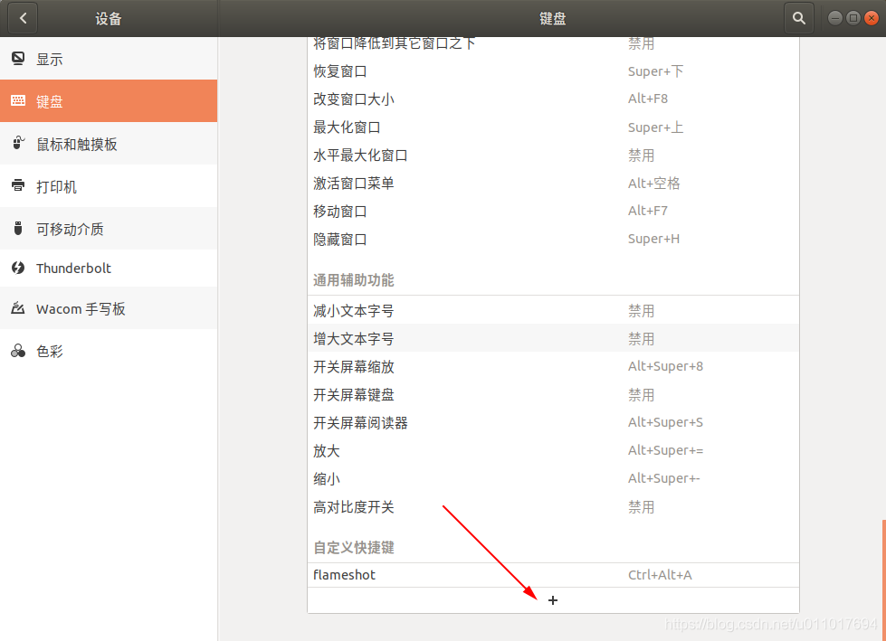

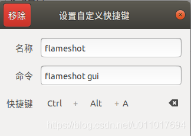


### Ubuntu 隐藏上方状态栏、左边任务栏及菜单按钮移到下方居中及隐藏（详细）

https://blog.csdn.net/weixin_43629813/article/details/100525856

https://blog.csdn.net/qq_42674100/article/details/89763787
